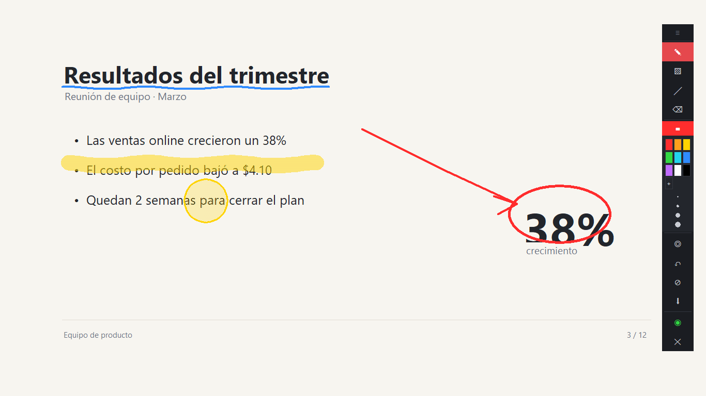

# EpicPenFreeVersion

[](https://github.com/Maurio6/EpicPenFreeVersion/releases/latest)
[](https://github.com/Maurio6/EpicPenFreeVersion/releases)
[](LICENSE)


Anotá sobre cualquier cosa que tengas en pantalla: presentaciones, videos, código, el navegador.
Una alternativa libre y de código abierto a Epic Pen, en un solo `.exe` que no instala nada.

*Free and open source screen annotation for Windows — an Epic Pen alternative. Draw on top of
slides, videos, code or the browser. Single portable `.exe`, no installer, no dependencies.*



**[Español](#español) · [English](#english)**

---

## Español

### Qué es

Una herramienta de anotación en pantalla para Windows, al estilo de Epic Pen. Pone una capa
transparente sobre todo el escritorio y te deja dibujar encima, sin dejar de usar las aplicaciones
que hay debajo.

- Lápiz, resaltador y goma
- Formas: línea, rectángulo y elipse
- Nueve colores a mano y selector para cualquier otro
- **Modo pizarra**: tapá la pantalla con un fondo oscuro o claro y escribí sobre él
- Halo que sigue al puntero, para señalar mientras explicás
- Deshacer y limpiar
- Guardar la pantalla anotada como PNG
- Modo click-through: la tinta se queda visible y seguís usando el ordenador normalmente

### Descarga

**La forma fácil:** bajá `EpicPen.exe` desde
[Releases](https://github.com/Maurio6/EpicPenFreeVersion/releases) y hacé doble click. Son 11 MB,
no hay instalador y **no necesitás tener Python**. Como no está firmado digitalmente, la primera vez
Windows puede mostrar un aviso de SmartScreen: *Más información → Ejecutar de todas formas*.

**Desde el código**, si preferís ver qué estás ejecutando:

```bash
git clone https://github.com/Maurio6/EpicPenFreeVersion.git
cd EpicPenFreeVersion
python -m epicpen
```

Doble click en `EpicPen.pyw` lo abre igual, pero sin la ventana negra de consola detrás.

### Requisitos

- **Windows 10 u 11**
- Solo si lo corrés desde el código: **Python 3.8 o superior** con tkinter (viene incluido en el
  instalador oficial de [python.org](https://python.org); es la opción *tcl/tk and IDLE*, marcada
  por defecto)

**No hay librerías que instalar.** Todo sale de la biblioteca estándar: `tkinter` para la interfaz,
`ctypes` para hablar con Windows y `zlib` para escribir los PNG. Por eso no vas a encontrar un
`requirements.txt` en el repo: no hay nada que poner dentro.

Al arrancar aparece una barra vertical a la derecha en **modo click**: la tinta que dibujaste sigue
viéndose, pero los clicks pasan de largo hacia las aplicaciones de abajo. Pulsá **F9** (o el botón
del círculo) para empezar a dibujar. La barra se arrastra desde el `≡` de arriba.

| Tecla | Qué hace |
|-------|----------|
| `F7`  | Pizarra: oscura → clara → apagada |
| `F8`  | Resaltar el puntero |
| `F9`  | Alternar dibujar / click |
| `F10` | Limpiar todo |
| `F11` | Deshacer el último trazo |
| `F12` | Guardar la pantalla como PNG |
| `Esc` | Volver al modo click |

Las capturas se guardan en `Imágenes\EpicPen` y aparece un aviso con la ruta; si le hacés click, se
abre el explorador con el archivo ya seleccionado.

El botón de formas cambia entre línea, rectángulo y elipse: el primer click la selecciona y los
siguientes van rotando entre las tres.

Con la **pizarra** puesta la pantalla queda tapada, así que los clicks ya no llegan a lo que había
debajo: es lo que querés para explicar algo desde cero, y se sale con `F7` o desde la barra, que
sigue encima. La tinta que ya habías dibujado se conserva por encima del fondo.

### Cómo funciona por dentro

La parte interesante es que un overlay transparente **no puede recibir clicks**. Windows pinta la
ventana con un *color-key*: el color de fondo se vuelve invisible, y esas zonas transparentes dejan
pasar el ratón hacia lo que haya debajo. Es justo lo que querés para no bloquear el escritorio, pero
significa que el canvas nunca se entera de que estás dibujando sobre él.

La solución es leer el ratón por fuera de la ventana, con hooks globales de bajo nivel
(`WH_MOUSE_LL` y `WH_KEYBOARD_LL`). Eso trae tres detalles que vale la pena conocer si vas a tocar
el código:

- **Nunca hay que tragarse `WM_MOUSEMOVE`.** El sistema mueve el puntero *después* de pasar por el
  hook, así que bloquear ese mensaje congela el cursor en la pantalla. Solo se interceptan los
  botones.
- **El hook tiene que devolver rápido.** Si tarda demasiado, Windows descarta el evento. Por eso el
  hook únicamente encola puntos y el dibujo real ocurre en un `after` de tkinter cada 8 ms. Por la
  misma razón, comprimir el PNG se hace en un hilo aparte: si bloqueara el bucle principal, se
  perderían clicks.
- **La repetición automática del teclado dispara `KEYDOWN` una y otra vez.** Sin filtrarla, dejar
  `F12` apretado guarda una ráfaga de capturas.

El PNG se escribe a mano (cabecera, `IHDR`, `IDAT` comprimido con `zlib`, `IEND`) en vez de añadir
Pillow al proyecto solo para guardar una imagen.

### Estructura

| Archivo | Responsabilidad |
|---------|-----------------|
| `epicpen/win32.py` | Lo único que habla ctypes: DPI, monitores, hooks globales |
| `epicpen/board.py` | Modelo de dibujo (trazos, formas, goma, deshacer). Sin tkinter: por eso se puede testear |
| `epicpen/overlay.py` | La ventana transparente que cubre todos los monitores |
| `epicpen/spotlight.py` | El halo que sigue al puntero |
| `epicpen/toolbar.py` | La barra flotante |
| `epicpen/toast.py` | El aviso que aparece al guardar |
| `epicpen/capture.py` | Captura de pantalla y escritura del PNG |
| `epicpen/app.py` | Controlador: conecta los hooks con el modelo y las vistas |

### Tests

```bash
python test_epicpen.py
```

Sin framework ni dependencias: son asserts sobre un canvas falso. Cubren el modelo de dibujo, que
el halo sobreviva a la goma, que el PNG generado sea válido, la conversión de coordenadas con
varios monitores y que la barra no pueda quedar fuera de la pantalla.

### Compilar el ejecutable

```bash
pip install pyinstaller
python -m PyInstaller --onefile --noconsole --name EpicPen EpicPen.pyw
```

Queda en `dist/EpicPen.exe`. PyInstaller hace falta solo para compilar: el programa en sí sigue sin
depender de nada.

### Limitaciones conocidas

- **Solo Windows.** Todo se apoya en la API del sistema.
- **Multi-monitor sin probar en hardware real.** Está implementado y hay un test que simula una
  segunda pantalla a la izquierda, pero se desarrolló con un único monitor.
- **La captura toma todos los monitores juntos**, así que con dos pantallas sale una imagen ancha.
- **El resaltador usa una trama, no transparencia real**, porque el canvas de tkinter no tiene
  canal alfa por elemento.
- **No hay herramienta de texto.** Como el overlay deja pasar los clicks, escribir exigiría
  gestionar el teclado y el cursor de edición a mano.

---

## English

### What it is

An on-screen annotation tool for Windows, in the spirit of Epic Pen. It puts a transparent layer
over the whole desktop and lets you draw on it while still using the apps underneath.

- Pen, highlighter and eraser
- Shapes: line, rectangle and ellipse
- Nine colors at hand, plus a picker for any other
- **Whiteboard mode**: cover the screen with a dark or light backdrop and write on it
- A halo that follows the cursor, for pointing while you explain
- Undo and clear
- Save the annotated screen as PNG
- Click-through mode: the ink stays visible while you keep using your computer normally

### Download

**The easy way:** grab `EpicPen.exe` from
[Releases](https://github.com/Maurio6/EpicPenFreeVersion/releases) and double-click it. It is 11 MB,
there is no installer, and **you do not need Python**. It is not code-signed, so Windows may show a
SmartScreen warning the first time: *More info → Run anyway*.

**From source**, if you would rather see what you are running:

```bash
git clone https://github.com/Maurio6/EpicPenFreeVersion.git
cd EpicPenFreeVersion
python -m epicpen
```

Double-clicking `EpicPen.pyw` runs the same thing without a console window behind it.

### Requirements

- **Windows 10 or 11**
- Only when running from source: **Python 3.8+** with tkinter (bundled with the official installer
  from [python.org](https://python.org) — the *tcl/tk and IDLE* option, checked by default)

**There is nothing to install.** Everything comes from the standard library: `tkinter` for the UI,
`ctypes` to talk to Windows, and `zlib` to write PNGs. That is why there is no `requirements.txt`
in this repo — there would be nothing to put in it.

It starts in **click mode** with a vertical toolbar on the right: your ink stays visible, but clicks
pass through to the apps below. Press **F9** (or the circle button) to start drawing. Drag the
toolbar by the `≡` handle at the top.

| Key   | Action |
|-------|--------|
| `F7`  | Whiteboard: dark → light → off |
| `F8`  | Highlight the cursor |
| `F9`  | Toggle draw / click-through |
| `F10` | Clear everything |
| `F11` | Undo last stroke |
| `F12` | Save the screen as PNG |
| `Esc` | Back to click mode |

Screenshots land in `Pictures\EpicPen` and a toast shows the path; clicking it opens Explorer with
the file already selected.

The shapes button cycles line → rectangle → ellipse: the first click selects it, further clicks
rotate through the three.

With the **whiteboard** on, the screen is covered, so clicks no longer reach what was underneath —
which is the point when you are explaining something from scratch. Leave it with `F7` or from the
toolbar, which stays on top. Ink drawn earlier is kept above the backdrop.

### How it works

The interesting part is that a transparent overlay **cannot receive clicks**. Windows paints the
window with a *color key*: the background color becomes invisible, and those transparent areas let
the mouse through to whatever is underneath. That is exactly what you want so the desktop stays
usable — but it also means the canvas never hears about your drawing.

The fix is to read the mouse from outside the window, using low-level global hooks (`WH_MOUSE_LL`
and `WH_KEYBOARD_LL`). Three things are worth knowing before touching that code:

- **Never swallow `WM_MOUSEMOVE`.** The system moves the pointer *after* the hook runs, so blocking
  that message freezes the cursor on screen. Only the buttons are intercepted.
- **The hook must return fast.** Take too long and Windows drops the event. That is why the hook
  only queues points while the actual drawing happens in a tkinter `after` every 8 ms — and why PNG
  compression runs on its own thread: blocking the main loop would lose clicks.
- **Keyboard auto-repeat fires `KEYDOWN` over and over.** Without filtering it, holding `F12` saves
  a burst of screenshots.

The PNG is written by hand (signature, `IHDR`, zlib-compressed `IDAT`, `IEND`) rather than adding
Pillow to the project just to save one image.

### Layout

| File | Responsibility |
|------|----------------|
| `epicpen/win32.py` | The only module that speaks ctypes: DPI, monitors, global hooks |
| `epicpen/board.py` | Drawing model (strokes, shapes, eraser, undo). No tkinter, which is what makes it testable |
| `epicpen/overlay.py` | The transparent window spanning every monitor |
| `epicpen/spotlight.py` | The halo that follows the cursor |
| `epicpen/toolbar.py` | The floating toolbar |
| `epicpen/toast.py` | The notice shown after saving |
| `epicpen/capture.py` | Screen grab and PNG encoding |
| `epicpen/app.py` | Controller: wires the hooks to the model and the views |

### Tests

```bash
python test_epicpen.py
```

No framework, no dependencies — just asserts against a fake canvas. They cover the drawing model,
the halo surviving the eraser, the generated PNG being valid, coordinate translation across
monitors, and the toolbar never landing off-screen.

### Building the executable

```bash
pip install pyinstaller
python -m PyInstaller --onefile --noconsole --name EpicPen EpicPen.pyw
```

It lands in `dist/EpicPen.exe`. PyInstaller is only needed to build: the program itself still
depends on nothing.

### Known limitations

- **Windows only.** It leans on the platform API throughout.
- **Multi-monitor untested on real hardware.** It is implemented, and a test simulates a second
  screen to the left, but development happened on a single display.
- **Captures span all monitors**, so a two-screen setup produces one wide image.
- **The highlighter uses a dither pattern, not real transparency**, because the tkinter canvas has
  no per-item alpha channel.
- **No text tool.** Since the overlay passes clicks through, typing would mean handling the
  keyboard and a caret by hand.

---

## Licencia / License

MIT — ver [LICENSE](LICENSE). Usalo, modificalo y compartilo libremente; lo único que se pide es
conservar el aviso de copyright.

*MIT — see [LICENSE](LICENSE). Use it, modify it and share it freely; the only requirement is
keeping the copyright notice.*

Este proyecto no está afiliado a Epic Pen ni a sus desarrolladores: es una herramienta
independiente, escrita desde cero, inspirada en la idea.

*This project is not affiliated with Epic Pen or its developers: it is an independent tool,
written from scratch, inspired by the idea.*
